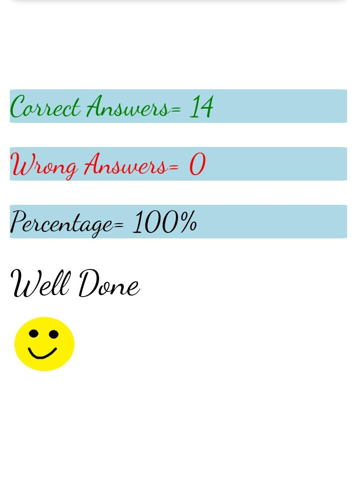

##  1.Who is the founder of JavaScript and When?
## Ans: Brenden Eich is the founder of JavaScript in 1995.

## 2.What was the first browser,when was it released?
## Ans:World Wide Web was the first browser and it released in 1990.

## 3.Name the two dominant browsers in 2000?
## Ans: NetScape Navigator and Internet Explorer are the two dominant browsers in 2000.

## 4.What is ECMA Script?
## Ans:European Computer Manufacturers Association Script that is used to standardise the scripting languages.

## 5.Define Syntax?
## Ans:Syntaxis a set of rules that has to be followed while writing code.

##  6.What is TC39?
## Ans:TC39 stands for Technical Committee under ECMA Internationa.It is part of ECMA, this is the institution which standardizes the JavaScript language under the “ECMAScript” specification. 

##  7.Name different Datatypes in JavaScript?
## There are mainly two datatypes:
### 1.Primitive datatypes
### 2.Non-Primitive

## 8.Explain Primitive and Non-Primitive datatypes?
## Ans:Primitive datatypes: this datatypes are default datatypes in javascript.Primitive datatypes are divided into the following:
## 1.String : String a set of characters enclosed in single or double quote.
## 2.Number:which means any number.
## 3.Boolean:The value is either True or False.
## 4.Undefined:which means the value is not assigned.
## 5.Null: It is the intentional absence of value.
## 6.BigTnt:This are the big number which is not in  the number datatype.

## Non-primitive datatypes: The dataypes are derived from the primitive datatypes.Non-Primitive datatypes are divided into the following:
## Array: Array is a collection ofdata enclosed in square bracket separated with comma.
### ex:Let array=["name",20,True]

## Object:Object is arelated data enclosed in curly braces in the form of key value pairs separated with comma.
### ex: let obj={
###            {name:"abc"}
###               {..}
###            }

## 9.Differentiate null and undefined?
## Ans:A variable in JavaScript that is without any value has a value of undefined. 
## Null:The null value denotes nothingness. It is supposed to denote something that does not exist.A variable in JavaScript that has a null value is of the ''object'' data type.

 ## quiz
 

  

